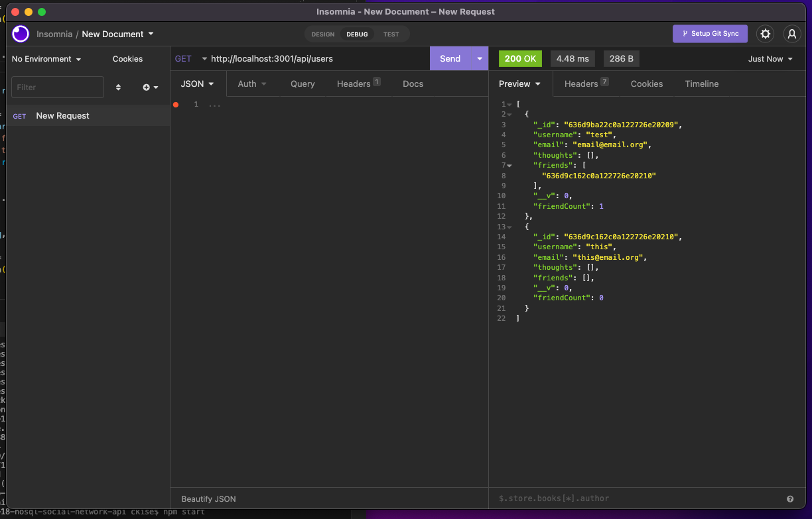
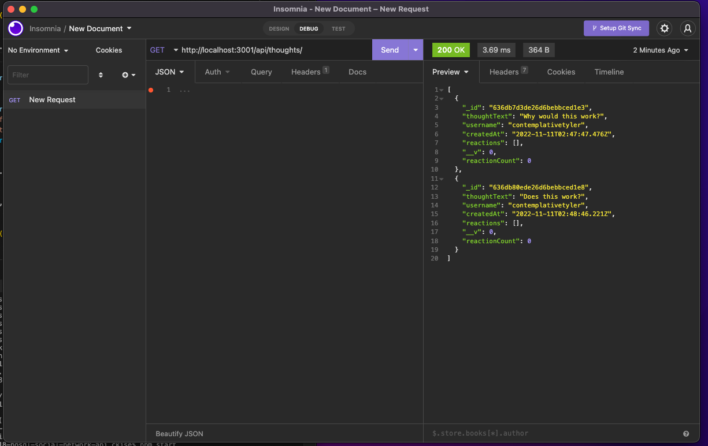

# ucb-assignment-18-nosql-social-network-api

# UCB Assignment 18 -- NoSQL Social Network API
This assignment was created for the Full Stack Developer program at UC Berkeley. Assignment number 18 details usage of NoSQl and creating a series of models (user, thought, reaction), as well as controllers for these components with associated routes. All routes are functional and are displayed in the short recording of insomnia.

## GitHub Links
https://github.com/cassandrakise/ucb-assignment-18-nosql-social-network-api
https://cassandrakise.github.io/ucb-assignment-18-nosql-social-network-api/

## Recording Links
https://watch.screencastify.com/v/6lokcj4la0txbBkEzUzv

## Images

